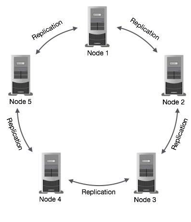

# Database Comparisions

## SQL
### MySQL

* Easy to use
* It is secure
  * MySQL consists of a solid data security layer that protects sensitive data from intruders. Also, passwords are encrypted in MySQL.
* Client/ Server Architecture
* It is scalable
  * MySQL supports multi-threading that makes it easily scalable. It can handle almost any amount of data, up to as much as 50 million rows or more. The default file size limit is about 4 GB. However, we can increase this number to a theoretical limit of 8 TB of data.

* Speed
MySQL is considered one of the very fast database languages, backed by a large number of the benchmark test.

* Allows roll-back

MySQL allows transactions to be rolled back, commit, and crash recovery.

* Memory efficiency

Its efficiency is high because it has a very low memory leakage problem.

* High Performance

MySQL is faster, more reliable, and cheaper because of its unique storage engine architecture. It provides very high-performance results in comparison to other databases without losing an essential functionality of the software. It has fast loading utilities because of the different cache memory.

* High Productivity

MySQL uses Triggers, Stored procedures, and views that allow the developer to give higher productivity.

* Partitioning

This feature improves the performance and provides fast management of the large database.

Disadvantages/Drawback of MySQL
Following are the few disadvantages of MySQL:

* MySQL version less than 5.0 doesn't support ROLE, COMMIT, and stored procedure.
* MySQL does not support a very large database size as efficiently.
* MySQL doesn't handle transactions very efficiently, and it is prone to data corruption.
* MySQL is accused that it doesn't have a good developing and debugging tool compared to paid databases.
* MySQL doesn't support SQL check constraints.
### SQLServer
### PostGresSQL
* Key Features
  * This supports the locking mechanism.
  * It has high availability.
  * It is free and open-source software.
  * This is ACID compliant.
  * It has the capacity for fault tolerance.
  * It also supports image, video, audio storage and supports graphical data.
  * It requires deficient maintenance.
  * It supports Multi-version concurrency control (MVCC).
  * Recovery is high.
  * It has user-defined data types.
  * Table inheritance.
  * It runs on all operating systems.

* What is the Use of PostgreSQL?
It has the following characteristics:

  * Sophisticated locking.
  * View.
  * Foreign key referential integrity.
  * Rules.
  * Inheritance.
  * MVCC (Multiple version concurrency control).
  * Subselects.
  * Transactions.
  * User-defined types.

## NoSQL
### Key Value
#### Couch DB
### Column Oriented
#### Cassandra
* Features of Cassandra
 * There are a lot of outstanding technical features which makes Cassandra very popular. Following is a list of some popular features of Cassandra:
 
 * High Scalability
    * Cassandra is highly scalable which facilitates you to add more hardware to attach more customers and more data as per requirement.

 * Rigid Architecture
   * Cassandra has not a single point of failure and it is continuously available for business-critical applications that cannot afford a failure.

* Fast Linear-scale Performance
  * Cassandra is linearly scalable. It increases your throughput because it facilitates you to increase the number of nodes in the cluster. Therefore it maintains a quick response time.

* Fault tolerant
 * Cassandra is fault tolerant. Suppose, there are 4 nodes in a cluster, here each node has a copy of same data. If one node is no longer serving then other three nodes can served as per request.

* Flexible Data Storage
  * Cassandra supports all possible data formats like structured, semi-structured, and unstructured. It facilitates you to make changes to your data structures according to your need.

* Easy Data Distribution
  * Data distribution in Cassandra is very easy because it provides the flexibility to distribute data where you need by replicating data across multiple data centers.

* Transaction Support
  * Cassandra supports properties like Atomicity, Consistency, Isolation, and Durability (ACID).

* Fast writes
 * Cassandra was designed to run on cheap commodity hardware. It performs blazingly fast writes and can store hundreds of terabytes of data, without sacrificing the read efficiency.

### Document Oriented
### Graph
